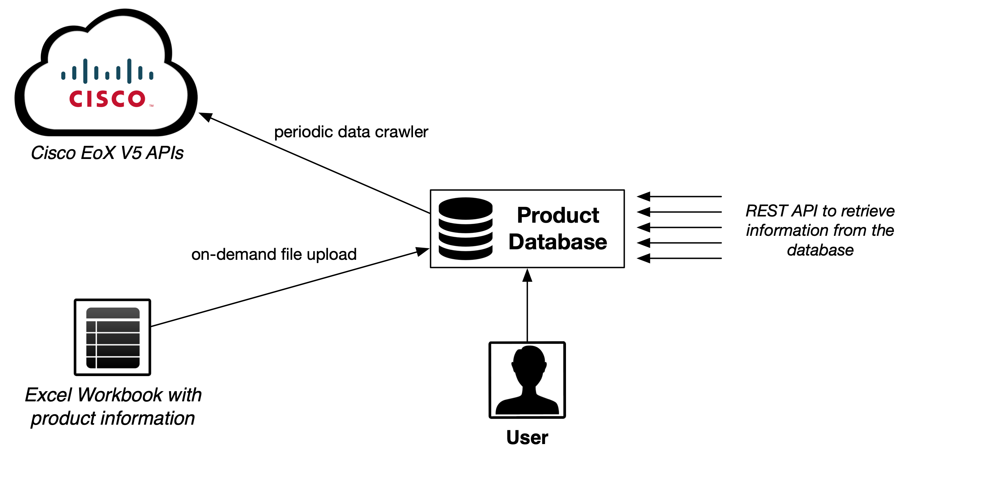

# Product Database

This web service provides a database and API for product information, focusing on the lifecycle data (EoL checks) for network products. 

The following features are implemented:

* automatic check of the lifecycle state for a list of products against the local database (Product Check)
* synchronization with the Cisco EoX API (initial sync and periodic sync for specific Product ID's)
* REST API to access the data
* data import using Excel (to add/update lifecycle data for other vendors)
* Product ID normalization function (convert an SNMP string to Product ID)

The following diagram shows an overview about the web service and the usage-options.



## Setup & Installation

To create a quick demo instance, just run the following commands:

```bash
git clone https://github.com/hoelsner/product-database.git
docker-compose -p productdb -f docker-compose.template.yaml build
docker-compose -p productdb -f docker-compose.template.yaml up -d
```

More details about a production instance are available at [Setup & Installation](docs/SETUP.md).

## License

See the [license](LICENSE.md) file for license rights and limitations (MIT).

## Cisco EoX APIs (Cisco Support APIs) within the Product Database

The Product Database is capable to synchronize the local database with the Cisco EoX API. More information about the API is available at [http://apiconsole.cisco.com](http://apiconsole.cisco.com) (login required). The Getting Started guide is available at the [Cisco DevNet](https://developer.cisco.com/docs/support-apis/#!introduction-to-cisco-support-apis/introduction-to-cisco-support-apis).